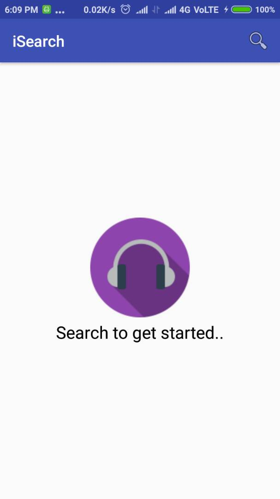
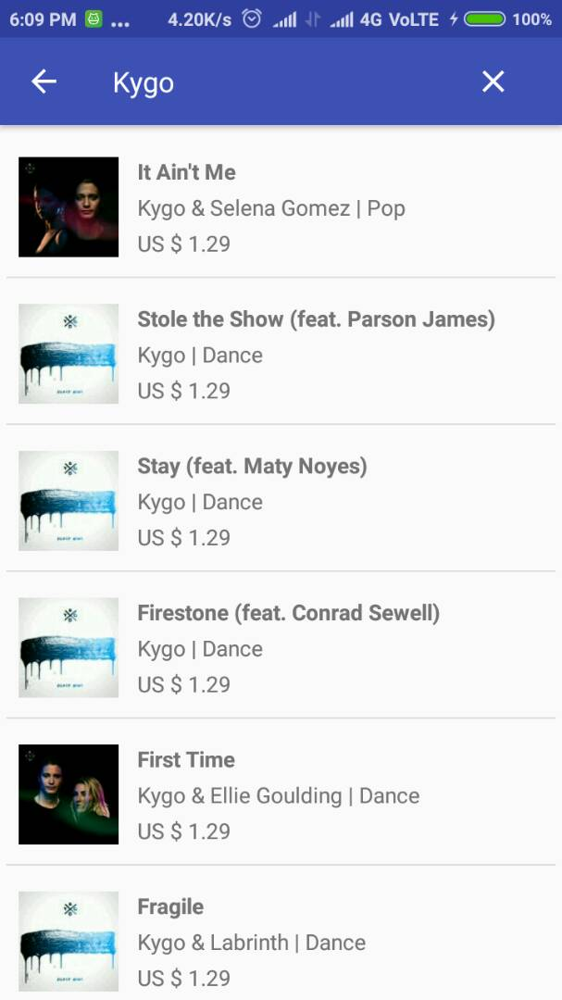
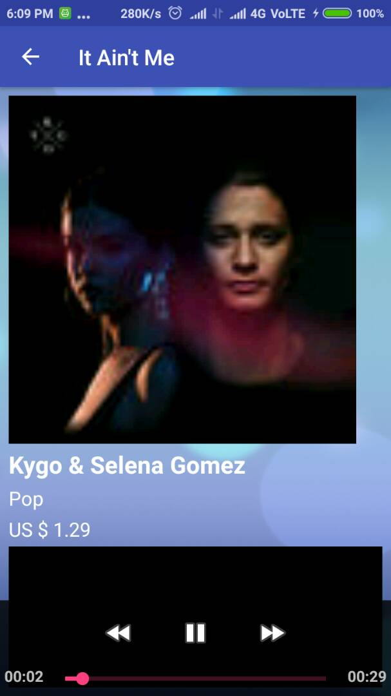

# iSearch
Song Search App using iTunes API.

## Getting Started

Clone the project and run to get started.

## Screenshots

## Built With

* [Retrofit](https://github.com/square/retrofit) - Network Calls
* [GSON](https://github.com/google/gson) - For JSON to JAVA Deserialization
* [Shimmer Recycler View](https://github.com/sharish/ShimmerRecyclerView) - To show shimmering effect in recycler view while loading
* [Glide](https://github.com/bumptech/glide) - Image Loading

## Author

* **[Mayur Patanvadiya](https://about.me/mayur_p)**
